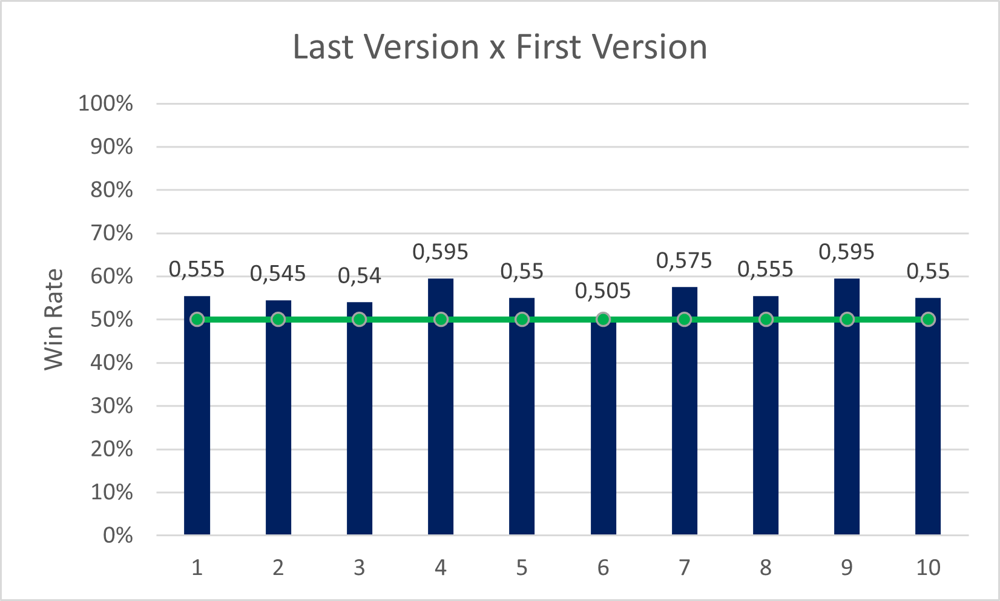

# Reinforcement-Learning-Surround
This project is the final evaluation for the Reinforcement Learning master´s course subject, conducted by Professor Flávio Codeço Coelho at FGV-EMAp. We developed two variations of an AlphaGo-like approach to solve the Atari game Surround via Reinforcement Learning.

# Summary

- [The Problem](#the-problem)
- [The Environment](#the-environment)
    - [Observation Space](#observation-space)
    - [Action Space](#action-space)
    - [Game Rules](#game-rules)
- [Solving the Problem](#solving-the-problem)
    - [Algorithm 1](#1-algorithm)
        - [Training](#training)
        - [Testing](#testing)
        - [Results](#results)
    - [Algorithm 2](#2-algorithm)
        - [Training](#training-1)
        - [Testing](#testing-1)
        - [Results](#results-1)
- [Conclusion](#conclusion)
- [Usage Guide](#usage-guide)
- [References](#references)

# The Problem

The aim of this project is to solve the Atari game Surround (shown in the figure below) using two different algorithms. The game starts with both players moving towards each other. As they move, they leave trails behind, until one of the snakes tries to move into an already occupied position. The goal is to surround the opponent snake without hitting the walls or the opponent snake.


<div align="center">
	 
</div>

# The Environment

The enviroment used in the original Surround game is a 11 x 11 grid where two snakes move around, leaving a trail behind them. On the Atari 2600 version, just one player controls the snake and the other snake is controlled by the computer. 

For this project, we recreated the game using PyGame a 16 x 16 grid where the two snakes are controlled by the users' inputs (as described in <a href="#usage-guide">Usage Guide</a>).

## Observation Space

The observation space is a 16 x 16 x 3 boolean matrix where each layer carries information about the game state. The first layer represents the walls, the second layer represents the first player's snake and the third layer represents the second player's snake. The figure below shows an example of the observation space.

<div align="center">
	 
</div>

## Action Space
Each action is represented by a number from 0 to 4, as shown in the table below.

<div align = "center">
<table>
  <tr>
    <th>Value</th> <th>Meaning</th>
  </tr>
  <tr>
    <td>0</td> <td>continue</td>
  </tr>
  <tr>
    <td>1</td> <td>right</td>
  </tr>
  <tr>
    <td>2</td> <td>up</td>
  </tr>
  <tr>
    <td>3</td> <td>left</td>
  </tr>
  <tr>
    <td>4</td> <td>down</td>
  </tr>
</table>
</div>

## Game Rules
The snakes' movements are based on the board's perspective, so pressing the up arrow key will make the snake go up on the board no matter its current direction.

Notice that, at each moment, the snake can't move to the opposite direction of its current movement. For instance, if the snake is moving to the right, it can't move to the left, so the action left will be considered as the continue action, which is equivalent to going to the right.

## Rewards
In our implementation, rewards are only applied to player 1. Winning an episode grants +100 points, losing an episode means receiving -100 points and a tie gives -10 points.

# Solving the Problem
We implemented two variations of an AlphaGo-like approach to solve the problem, using Monte Carlo Tree Search (MCTS). The first relies solely on MCTS, while the second uses a neural network to guide the tree expansion, learning how to evaluate the game state and how to select the best action. We considered the problem solved if the trained models were capable of winning against a "clever random player", that is, one that chooses randomly among the set of actions that would not lead to its death.

## Algorithm 1: Pure Monte Carlo Tree Search
MCTS builds up a tree where each node represents a game state. Using Upper confidence Bound (UCB1) or UCB1-Tuned algorithms [[3]](#3), each of the two players chooses moves simultaneously until a leaf node is reached. Then, we simulate a game for each legal move (moves that don't run into a wall), from that node state until the end. Finally, we backpropagate the results of the simulations to the root node, updating the nodes' statistics. This implementation uses a altered reward system where a win is valued as 1, a draw is valued at 0 and losing is valued at -1. Playing a game, the moves choosen are the moves with highest score for each player.

### Results
The figure below shows the result show the result of a 100 games where the two agents are using MCTS, where player 1 is using UCB1 and player two is UCB1-Tuned.
<div align="center">
	 
</div>

## Algorithm 2
This variation adds a neural network to the MCTS algorithm. The neural network is used to evaluate the game state and to select the best action. The neural network is trained playing against itself, until it becomes capable of achieving a certain win rate against its past version. As explained in the AlphaGo Zero paper (Silver _et al_., 2017):

```
"AlphaGo becomes its own teacher: a neural network is trained to predict AlphaGo’s own move selections and also the winner of AlphaGo’s games. This neural network improves the strength of the tree search, resulting in higher quality move selection and stronger self-play in the next iteration."
```

### Results
The figure below shows the evolution of the neural network's win rate against its past version. We ran 10 samples of 100 games between the last state of the neural network against its first state. The results highlight the fact that the neural network improved over time, winning more games against its past version.

<div align="center">
	 
</div>

# Conclusion
Algorithm 1 proved itself capable of winning against a clever random player, while Algorithm 2 is as good as a clever random player. Nonetheless, Algorithm 1 has demonstrated improvement over time, beating its initial version. Although the results are not impressive, we believe that better performance could be achieved with better hardware, more training time and by applying other heuristics to the MCTS algorithm.

# Usage Guide
In order to run the code, you must have Python 3.11 and the modules listed in the requirements.txt file installed. We recommend using a virtual environment:
  
  ```bash
  python -m venv rl-surround
  
  source rl-surround/Scripts/activate 
  # rl-surround\Scripts\activate on Windows
  
  pip install -r requirements.txt
  ```

  To play the game against our best MCTS model, run the following command:
  
  ```
  python game/run_me.py mcts
  ```

  To play the game against our best Neural Net model, run the following command:
  
  ```
  python game/run_me.py net
  ```

  To play the game against a clever random model, run the following command:
  
  ```
  python game/run_me.py random
  ```

  To watch the last neural net play against the first, run the following command:
  
  ```
  python game/run_me.py evolution
  ```

  To play the game against a human player, run the following command:
  
  ```
  python game/run_me.py human
  ```

  For a one human player game, the controls are WASD. For a two human player game, the controls are WASD for the first player and the arrow keys for the second player.

# References
The theoretical basis and implementation of this project were based on the following references:

<a id="1">[1]</a> LANCTOT, Marc; WITTLINGER, Christopher; WINANDS, Mark H. M.; TEULING, Niek G. P. Den. Monte Carlo Tree Search for Simultaneous
Move Games: A Case Study in the Game of Tron. **Proceedings of Computer Games Workshop**. 2012. Available at: <https://dke.maastrichtuniversity.nl/m.winands/documents/sm-tron-bnaic2013.pdf>. Access on: 2023/10/15.

<a id="1">[2]</a> LAPAN, Maxim. **Deep Reinforcement Learning Hands-On**. 2nd Edition. Packt Publishing, 2020.

<a id="1">[3]</a> PREICK, Pierre; ST-PIERRE, David L.; MAES, Francis; ERNST, Damien. Comparison of Different Selection Strategies in Monte-Carlo Tree
Search for the Game of Tron. **IEEE Conference on Computational Intelligence and Games (CIG)**, Granada, Spain, 2012, pp. 242-249, DOI: 10.1109/CIG.2012.6374162.

<a id="1">[4]</a> SILVER, D., HUANG, A., MADDISON, C. _et al_. Mastering the game of Go with deep neural networks and tree search. **Nature**, n. 529, p. 484–489 (2016). DOI: 10.1038/nature16961

<a id="1">[5]</a> SILVER, D.; SCHRITTWIESER, J.; SIMONYAN, K. _et al_. Mastering the game of Go without human knowledge. **Nature**, n. 550, p. 354–359 (2017). DOI: 10.1038/nature24270

<a id="1">[6]</a> SLOANE, Andy. **Google AI Challenge post-mortem**. 2011. Available at: <https://web.archive.org/web/20111230055046/http://a1k0n.net/2010/03/04/google-ai-postmortem.html>. Access on: 2023/10/15.

<a id="1">[7]</a> SUTTON, Richard S.; BARTO, Andrew G. **Reinforcement Learning: An Introduction**. 2nd Edition. MIT Press, 2018.

<a id="1">[8]</a> WANG, Qi. **Connect 4 with Monte Carlo Tree Search**. 2022. Available at: <https://www.harrycodes.com/blog/monte-carlo-tree-search>. Access on: 2023/10/15.
